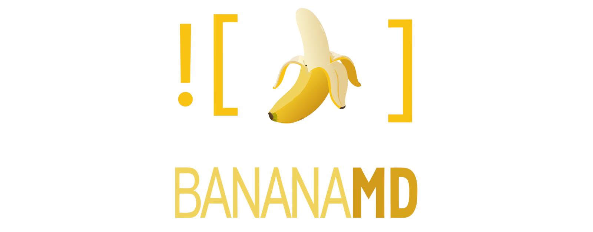

<p align="center">
  <a href="https://github.com/DavidLMS/bananamd/pulls">
    
  </a>
  <a href="LICENSE">
      
    </a>
</p>

# BananaMD – Nano Banana Hackathon

Illustrate Markdown documents and slide decks at speed with Gemini 2.5 Flash Image Preview (aka Nano Banana). Upload a `.md` or a `.zip` with your project, get two high‑quality proposals per image reference, iteratively edit with text, and export a polished package with descriptive filenames and accessible alt text.

<p align="center">
    <a href="https://github.com/DavidLMS/bananamd/issues/new?assignees=&labels=bug&projects=&template=bug_report.md&title=%5BBUG%5D">Report Bug</a>
    ·
    <a href="https://github.com/DavidLMS/bananamd/issues/new?assignees=&labels=enhancement&projects=&template=feature_request.md&title=%5BREQUEST%5D">Request Feature</a>
    ·
    <a href="https://deepwiki.com/DavidLMS/bananamd">Documentation</a>
  </p>

## Why this exists

I’m a teacher, and most of my course material lives in Markdown. Ideas come fast; images don’t. Going slide‑by‑slide to illustrate, or reviving old figures with a fresher style, is the kind of work that quietly steals prep time and energy. Yet a good image, at the right moment, can change an explanation.

BananaMD is my pragmatic answer: a tool that doesn’t try to “replace” anything — it simply steps on the accelerator where it hurts most. You drop a `.md` (or a `.zip` with your project) and get context‑aware visual proposals, with natural‑language iterative edits to refine what matters. When I decide, I move on. When I’m done, I export a clean package with descriptive filenames and —an important detail— autogenerated alt text for every image. Accessibility without haggling, because students using screen readers deserve the picture too.

It’s not magic; it’s craft with new tools. Sometimes I want a brand‑new image; other times I want to keep the content and “redraw” it in the style of the first one I liked. BananaMD lets me do both with minimal friction. And in day‑to‑day teaching, you feel the difference.

## What it does

- Upload a `.md` file, or a `.zip` containing a `.md` and image folders.
- Optional: provide a style reference image; optional: “Try to maintain the style of the first image”.
- Click “Generate”. For every `` or ``:
  - If the link points to a valid image (local in the zip, data URL, or downloadable HTTP URL), treat it as an existing image.
  - Otherwise, generate from text using document context.
- For each reference, see two proposals side‑by‑side, open “See context”, and use a textbox to apply iterative edits (with a version history 2/2, 3/3…). Pick one and move to the next.
- Export:
  - Main zip: updated `.md` + `images/` with descriptive slugs (and alt text) generated by Gemini using the final image.
  - Optional zip: all generated images (used and discarded).
  - A preview renders below with images inlined.

## How it works (short)

- Generate from text: Gemini analyzes the full file + 500 chars of local context to propose two descriptions; those are converted to two “nano‑prompt” prompts.
- Generate from image: left = improve/redraw in the style reference (if any) starting from the original; right = describe the original with Gemini and then run through the text flow.
- If “maintain style” is checked and you select the very first image, that image becomes the style reference for the rest.
- All prompts live in editable `.txt` templates for easy iteration: `context_to_description.txt`, `description_to_nano_prompt.txt`, `image_to_description.txt`, `image_to_filename_description.txt`.

## Built with

- React + TypeScript + Vite (client‑only)
- `@google/genai` (Gemini 2.5 Flash Image Preview for image, Gemini 2.5 Flash for text)
- JSZip (read/write zip entirely in the browser)

## Run locally

Prerequisite: Node.js 18+

```bash
npm install
echo "GEMINI_API_KEY=YOUR_KEY" > .env.local
npm run dev
```

Open http://localhost:5173 and paste your Gemini API key in `.env.local` beforehand.

## Gemini integration write‑up

BananaMD uses two Gemini models: **Gemini 2.5 Flash Image Preview** for any operation that must return an image (text‑to‑image, image‑to‑image editing/variation), and **Gemini 2.5 Flash** for all text‑only operations (context analysis, description drafting, prompt shaping, and filename/alt generation). Flow: (1) For text‑to‑image, Gemini Flash (text) first proposes two image descriptions from the Markdown (global file + 500‑character local window). Those are converted, via a lightweight template, into two high‑quality prompts; then Image Preview (Nano Banana) renders the two proposals. (2) For image‑to‑image, the left proposal edits the original with explicit “redraw in the attached style reference, preserve composition and subjects”; the right proposal is produced from a Gemini‑generated description of the original and then rendered via Image Preview. (3) Iterative edits apply as chat‑like turns anchored on the current image. Finally, Gemini Flash (text) receives the selected image (as inline data) to propose a web‑safe slug and concise alt text. All prompting lives in external `.txt` templates so teams can tune tone and strictness quickly during the hackathon.

## Notes & limits

- Client‑only: files never leave your browser. If a remote URL can’t be fetched (CORS/404), the app falls back to generation from text.
- Rate limits: built‑in retries with backoff.
- Sequential generation per reference.

## License

BananaMD is released under the [Creative Commons Attribution 4.0 International License (CC BY 4.0)](https://creativecommons.org/licenses/by/4.0/). You are free to use, modify, and distribute the code and educational content for any purpose, including commercial use, as long as you provide appropriate attribution.
